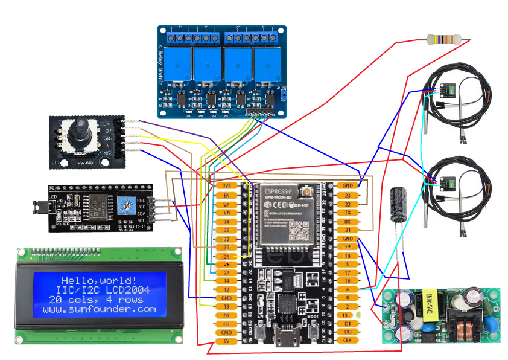

# 🍺 Contrôleur de Fermentation ZORBACK (ESPHome)

**Auteur :** Zorback (avec l'aide de Gemini)  
**Version :** 1.0  
**Licence :** [GNU General Public License v3.0](https://www.gnu.org/licenses/gpl-3.0.html)

Ce projet est un contrôleur de température double flux pour la fermentation de bière. Il utilise un **ESP32** sous **ESPHome** pour piloter un groupe froid et un système de chauffe via des relais, avec un affichage LCD et un encodeur rotatif pour le réglage des consignes.

---

## 📸 Aperçu du Montage

Le schéma suivant détaille les connexions réelles entre l'ESP32 et les différents modules :

---

## 📋 Liste des Composants (selon schéma)

| Composant | Description |
| :--- | :--- |
| **Microcontrôleur** | ESP32-WROOM-32U (38 pins) |
| **Alimentation** | Module AC-DC 220V -> 5V (Power Supply) |
| **Relais** | Module 4 Relais (5V) pour le contrôle Chaud/Froid |
| **Capteurs** | 2x Sondes DS18B20 (OneWire) |
| **Affichage** | Écran LCD 2004 avec interface I2C (PCF8574) |
| **Contrôle** | Encodeur rotatif (KY-040) pour la navigation |
| **Passifs** | 1x Résistance 4.7kΩ et 1x Condensateur chimique |

---

## ⚡ Plan de Câblage (Pinout ESP32)

D'après le schéma de montage, voici les correspondances des broches :

### 🌡️ Capteurs & I2C
* **I2C (LCD) :** SDA -> **GPIO21** | SCL -> **GPIO22**
* **OneWire (Sondes) :** DATA -> **GPIO4** (avec résistance de 4.7kΩ vers le 3.3V)

### 🕹️ Interface Utilisateur
* **Encodeur :** CLK -> **GPIO32** | DT -> **GPIO33**
* **Bouton :** SW -> **GPIO25**

### 🔌 Relais (Contrôle Puissance)
* **Relais 1 (Chaud F1) :** IN1 -> **GPIO13**
* **Relais 2 (Froid F1) :** IN2 -> **GPIO14**
* **Relais 3 (Chaud F2) :** IN3 -> **GPIO26**
* **Relais 4 (Froid F2) :** IN4 -> **GPIO27**
